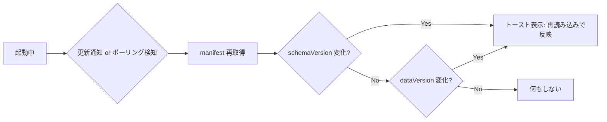

## Snapshot 運用メモ（読み取り専用・ページロード時のみ初期化）

### 目的
- 初速最優先の読み取り専用データ配信。
- ページロード時にのみ DB を初期化（起動中の live update は基本しない）。
- スキーマ変更・データ更新に簡潔に追随。

### 用語
- **schemaVersion**: テーブル構造の版（スキーマ変更時にインクリメント）
- **dataVersion**: データ内容の版（新規/更新/削除などで更新）
- **manifest**: 最新スナップショットのメタ情報を返す JSON

---

## 推奨方針（ページロード時だけ manifest チェック）
- 配信:
  - 不変ファイル: `https://cdn.example.com/snapshots/v{schema}-{stamp}.sqlite`（長期キャッシュ/immutable）
  - 可変ファイル: `snapshot.manifest.json`（no-cache）
- manifest 例:
```json
{
  "schemaVersion": 3,
  "dataVersion": "2025-09-01T12:00:00Z",
  "snapshotUrl": "https://cdn.example.com/snapshots/v3-2025-09-01T12_00.sqlite"
}
```
- クライアント（ページロード時の1回だけ実行）:
  - manifest を fetch（no-cache）
  - 取得した `snapshotUrl` をダウンロードしてメモリ DB を初期化
  - `schemaVersion`/`dataVersion` を `localStorage` に保存しておくと可視化・デバッグに便利（必須ではない）
- スキーマ変更:
  - サーバ側で `schemaVersion` を上げたスナップショットを生成
  - 次のページロードで新スキーマの DB を初期化（起動中のケアは不要）

---

## オフライン対応（任意強化）
- 目的: 同バージョン再訪時のダウンロードを省略、オフラインでも即起動
- 追加:
  - DB バイト列（`Uint8Array`）を IndexedDB に保存（キーに `schemaVersion` を含め混在防止）
  - ページロード時: manifest チェック → バージョン同一なら IndexedDB から読み込み
- スキーマ変更:
  - `schemaVersion` が変われば別キーで保存。旧キーは後で掃除

---

## ライブアップデート（任意、ユーザーへリロード促し）
基本路線は「初期ロードのみ」だが、ユーザーがページを開いたままでも更新を検知し、トースト等で「再読み込みして反映」を促すことで UX を向上できる。

- 共通の判定
  - `schemaVersion` 増加: 互換性なし → リロード促し（必須）
  - `dataVersion` 変化: 互換性あり → リロード促し（推奨）。必要ならサイレント反映（スナップショット差し替え→即再クエリ）も可

- 選択肢
  - **ポーリング**
    - 方法: `snapshot.manifest.json` を一定間隔で no-cache 取得（起動、フォーカス、オンライン復帰トリガも追加）
    - 長所: 実装が最も簡単・CDN で完結
    - 短所: 反映までの遅延は最長で間隔相当
    - 目安: 30–300 秒
  - **SSE（Server-Sent Events）**
    - 方法: `/events` に接続し、`{"dataVersion":"...","schemaVersion":n}` を配信
    - 長所: 単方向・実装簡易・中継も容易
    - 短所: 一部環境で接続数制限やプロキシ影響
  - **WebSocket**
    - 方法: サーバから「更新あり」を push
    - 長所: 双方向・他機能と統合しやすい
    - 短所: 実装/運用が重め（スケーリング、接続管理）
  - 備考: どの方式でも「通知を受けたら manifest を再取得して最終確認」→ トーストで `location.reload()` を促す運用が堅い

- 簡易フロー（どの方式でも共通）


- 参考 UI（擬似コード）
```ts
// 更新通知を受けたら manifest を確認し、変化があればトースト表示して reload を促す
function onUpdateSignal() {
  fetch("/snapshot.manifest.json", { cache: "no-cache" })
    .then(r => r.json())
    .then(m => {
      const prevSchema = Number(localStorage.getItem("schemaVersion") || "0");
      const prevData = localStorage.getItem("dataVersion");
      if (m.schemaVersion > prevSchema || m.dataVersion !== prevData) {
        showToast("データが更新されました。再読み込みしますか？", {
          actionText: "今すぐ更新",
          onAction: () => location.reload(),
        });
      }
    });
}
```

---

## スナップショット生成・配信の運用
- 実行トリガー
  - **Cron（pull）**: 5〜15分おきに生成→アップロード→最後に manifest を更新
  - **Webhook（push）**: データ追加/更新イベントでトリガー→生成→アップロード→manifest 更新
- 配信ルール
  - スナップショット: バージョン付き・不変 URL＋`Cache-Control: immutable, max-age=31536000`
  - manifest: 可変・`Cache-Control: no-cache`
  - 更新順序: 「スナップショットを先にアップロード」→「manifest を最後に更新」(原子性)

---

## クライアント初期化（疑似コード：ページロード時のみ）
```ts
type Manifest = {
  schemaVersion: number;
  dataVersion: string;
  snapshotUrl: string;
};

async function initDbOnPageLoad(SQL: any) {
  const m: Manifest = await fetch("/snapshot.manifest.json", { cache: "no-cache" }).then(r => r.json());

  // オフライン対応する場合は、同一バージョンなら IndexedDB から復元する分岐を入れる
  // const cached = await loadFromIndexedDB(m.schemaVersion, m.dataVersion);
  // if (cached) return new SQL.Database(cached);

  const buf = await fetch(m.snapshotUrl, { cache: "no-cache" }).then(r => r.arrayBuffer());
  const db = new SQL.Database(new Uint8Array(buf));

  // オフライン対応（任意）
  // await saveToIndexedDB(m.schemaVersion, m.dataVersion, db.export());

  // 可視化/デバッグ（任意）
  localStorage.setItem("schemaVersion", String(m.schemaVersion));
  localStorage.setItem("dataVersion", m.dataVersion);

  return db;
}
```

---

## 失敗時の振る舞い
- manifest/スナップショット取得失敗: エラーメッセージ表示。オフライン対応採用時は旧版（IndexedDB/キャッシュ）を継続使用。
- 次回ページロード時に再試行。

---

## まとめ
- 基本は「ページロード時のみ初期化」。起動中は live update を前提にしない。
- ただし通知（ポーリング/SSE/WebSocket）で更新検知→リロード促しの導入は簡単で効果的。
- 配信は「不変スナップショット＋可変 manifest」二段構成。更新は Cron/Webhook で回す。
- オフライン対応が要るなら IndexedDB 保存を追加し、キーに `schemaVersion` を含める。